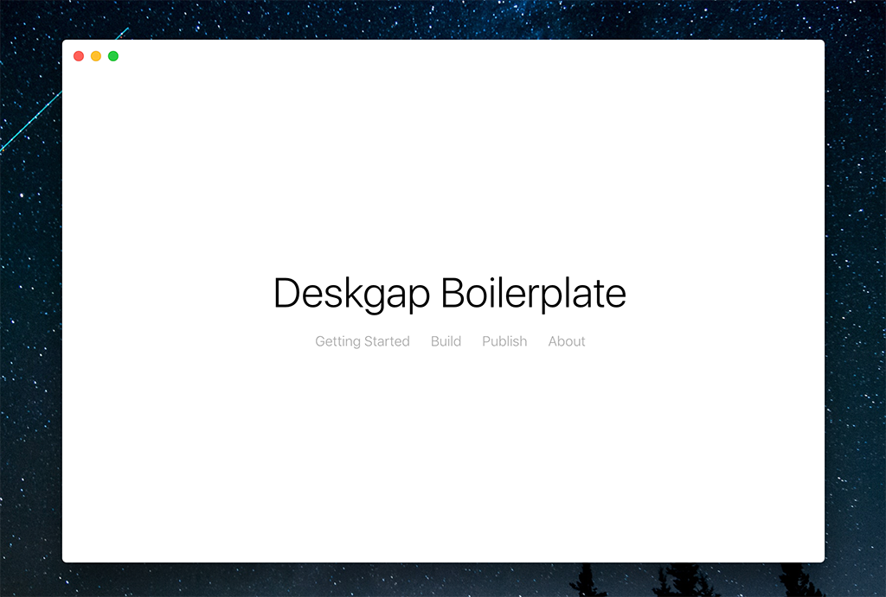

# Deskgap Parcel

A Simple Boilerplate for Deskgap with Parcel

##### About Deskgap

> DeskGap is a framework for building cross-platform desktop apps with web technologies (JavaScript, HTML and CSS). To enable native capabilities while keeping the size down, DeskGap bundles a Node.js runtime and leaves the HTML rendering to the operating system‘s webview. https://deskgap.com/

##### About Parcel

> Parcel is a Blazing fast, zero configuration web application bundler https://parceljs.org

### Feature

- Hot Reload
- Zero Config (Parcel)
- SASS / SCSS
- Prettier & Eslint

### Usage

1. Clone this repo to your local machine.

> \$ git clone https://github.com/muhibbudins/deskgap-parcel.git

2. Run NPM Install

> \$ cd deskgap-parcel && npm install

3. Remove Git folder and re-init

> \$ rm -rf .git && git init

4. Ejoy your project!

> \$ npm run dev

### Scripts

|  Script   | Description |
| :-------: | :---------: |
| build:dev |      -      |
| serve:dev |      -      |
|    dev    |      -      |
|   build   |      -      |
|   start   |      -      |

### License

This Project under MIT License
